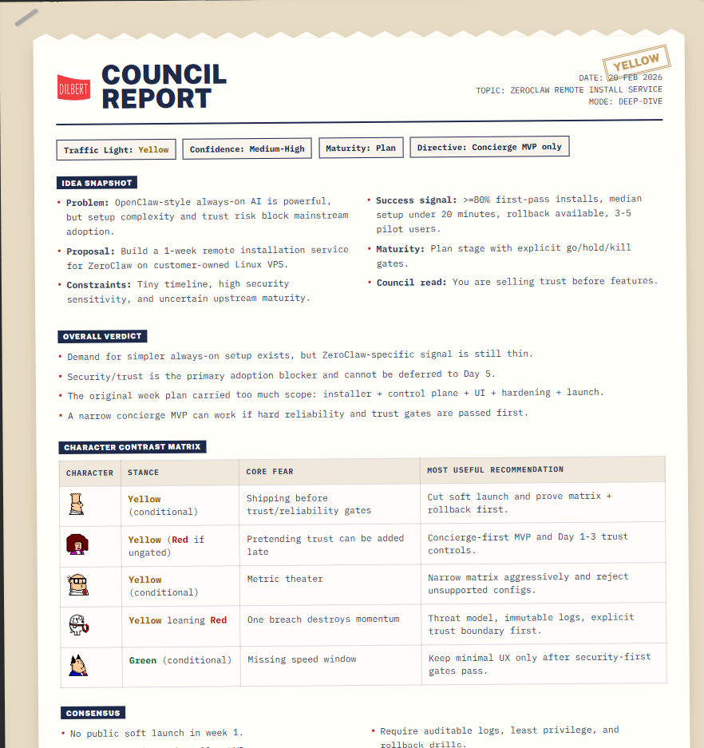

# Dilbert Council for Codex

Codex-only multi-agent setup for ruthless, funny, high-signal idea and plan reviews using five Dilbert characters:

- `dilbert`
- `alice`
- `wally`
- `dogbert`
- `phb`

Version 2 adds backstage evidence and synthesis support:

- `scribe` for shared claim ledgers and weighted criteria
- `arbiter` for score-based calibration and verdict tightening

This repository is designed to be cloned and used directly with Codex. It ships the full local `.codex` configuration (agents + skill) so no extra setup is needed beyond running Codex in this folder.

## Tribute Disclaimer

This project is a fan tribute to the legendary Scott Adams and the Dilbert comic universe and characters. It is an unofficial, community-built configuration for Codex and is not affiliated with or endorsed by Scott Adams, Dilbert, or associated rights holders.

## Requirements

- Codex `>= 0.104` (multi-agent capability required).
- Check your version with `codex --version`.
- If your version is lower, update Codex first, then run this repo.

## What You Get

- A reusable skill: `.codex/skills/dilbert-council/SKILL.md`
- Seven agent configs: five visible council members plus two backstage specialists.
- Shared claim-ledger workflow instead of five loosely grounded opinions.
- Stakes-aware mode escalation so short prompts can still trigger deep review.
- Directed cross-examination in deeper runs to pressure-test claims.
- Structured JSON sidecar plus deterministic HTML export.
- Evaluation reference for future benchmark runs.

## Quick Start

1. Clone this repo.
2. Open a terminal in the repo root.
3. Launch Codex in this directory (`codex`).
4. Ask Codex to run the skill.

Example prompts:

- `Use dilbert-council quick-roast this idea: "AI meal planner for families".`
- `Use dilbert-council deep-dive this plan and do web research first.`
- `Run the council on this proposal and give me go/hold/kill gates.`
- `Use dilbert-council on this proposal, build a claim ledger first, and export JSON + HTML artifacts at the end.`

## First 5 Minutes

Use this exact smoke test after cloning:

1. Start Codex in this repo: `codex`
2. Paste this prompt:
`Use dilbert-council quick-roast this idea: "Build an AI-powered personal kanban app with a monthly subscription for non-corporate users."`
3. Confirm output includes:
- all five character memos (`Dilbert`, `Alice`, `Wally`, `Dogbert`, `PHB`)
- one consolidated `Council Report`
- a weighted scorecard, claim ledger, overall verdict, and a concrete 7-day next step
4. Run a deep-dive test prompt:
`Use dilbert-council deep-dive this plan and use web research first. Then include go/hold/kill gates and sources.`
5. In a deep-dive run, confirm:
- the report includes a claim ledger
- at least one decisive disagreement survives into synthesis
- the appendix includes cross-examination, not just generic rebuttals

## Repository Structure

- `.codex/config.toml`: Local Codex config entry point.
- `.codex/skills/dilbert-council/SKILL.md`: Skill workflow and report format.
- `.codex/agents/dilbert.toml`: Engineering realism and hidden complexity.
- `.codex/agents/alice.toml`: Execution rigor and scope discipline.
- `.codex/agents/wally.toml`: Incentive/process failure detection.
- `.codex/agents/dogbert.toml`: Adversarial strategy, exploitability, PR/legal risk.
- `.codex/agents/phb.toml`: Exec theater failure modes and metric abuse.
- `.codex/agents/scribe.toml`: Hidden evidence normalizer and claim-ledger builder.
- `.codex/agents/arbiter.toml`: Hidden calibration and synthesis specialist.
- `.codex/skills/dilbert-council/references/output-contract.md`: JSON contract for exports.
- `.codex/skills/dilbert-council/references/eval-harness.md`: Benchmark prompts and scoring rubric.
- `.codex/skills/dilbert-council/scripts/render_dilbert_council_report.py`: JSON-to-HTML renderer.

## Run Modes

Defined in the skill:

- `quick-roast`: Fast, high-signal critique for rough ideas.
- `standard`: Default balanced run.
- `deep-dive`: Full analysis for detailed or high-stakes plans (includes directed cross-examination).

Mode selection now depends on both prompt maturity and decision stakes.

## Web Research Behavior

The skill supports optional research-first runs.

- Use web research when external facts materially affect decisions (market demand, competitors, pricing, regulation, security incidents, time-sensitive claims).
- Skip web research for mostly internal judgment calls (org design, team process, conceptual brainstorming).

When enabled, research should be centralized into one shared **Evidence Packet** before spawning visible agents. Do not run redundant per-agent web searches by default.

Every run now also creates a shared **Claim Ledger**. Even when the skill skips web research, it should still separate facts, inferences, assumptions, and unknowns.

## Output Shape

The council report is structured to maximize usefulness:

- idea snapshot
- council read
- memorable lines
- weighted scorecard
- evidence snapshot
- claim ledger
- overall verdict + confidence
- character contrast matrix
- consensus and productive disagreements
- ranked risks with mitigations
- 7-day next step
- 30-day de-risk plan (for deep-dive)
- decision gates (`go` / `hold` / `kill`)
- cross-examination appendix
- appendix with full individual memos

Reader-facing sections should use plain-English claim summaries. The ledger IDs are still available for traceability, but the report should not make the user decode raw item numbers to understand the recommendation.

If artifact export is requested, the skill writes:

- `<subject-slug>-dilbert-council-report.json`
- `<subject-slug>-dilbert-council-report.html`

## HTML Report Export (Optional)

After generating the council report, the skill can optionally create a structured JSON sidecar and a styled local HTML report.

- Output files (current working directory):
  - `<subject-slug>-dilbert-council-report.json`
  - `<subject-slug>-dilbert-council-report.html`
- Template source: `.codex/skills/dilbert-council/assets/templates/dilbert-council-report-template.html`
- Renderer: `.codex/skills/dilbert-council/scripts/render_dilbert_council_report.py`

Run the renderer with:

- `uv run .codex/skills/dilbert-council/scripts/render_dilbert_council_report.py <subject-slug>-dilbert-council-report.json`

The subject slug is a short lowercase hyphenated prefix derived from the run topic. Use the same prefix for both files so multiple council runs in one directory stay distinct.
- Image assets used by the template:
  - `.codex/skills/dilbert-council/assets/images/dilbert-logo-small.png`
  - `.codex/skills/dilbert-council/assets/images/Dilbert.png`
  - `.codex/skills/dilbert-council/assets/images/Alice.png`
  - `.codex/skills/dilbert-council/assets/images/Wally.png`
  - `.codex/skills/dilbert-council/assets/images/Dogbert.png`
  - `.codex/skills/dilbert-council/assets/images/PHB.png`

The export preserves the report look-and-feel and readability details:

- Manila-folder visual style and report layout
- Character image sizing for memo and cross-examination cards
- Character image icons in the contrast matrix
- Markdown-to-HTML rendering for appendix memos and cross-examination blocks (`#` headings, `**bold**`, bullets)
- Color-coded risk labels (`Green`, `Yellow`, `Red`) via CSS classes
- Council humor preserved in the top-level synthesis instead of stripped out during export

Preview reference: 

## Customization

Adjust character behavior in:

- `.codex/agents/alice.toml`
- `.codex/agents/dilbert.toml`
- `.codex/agents/wally.toml`
- `.codex/agents/dogbert.toml`
- `.codex/agents/phb.toml`

Adjust backstage behavior in:

- `.codex/agents/scribe.toml`
- `.codex/agents/arbiter.toml`

Adjust orchestration/reporting in:

- `.codex/skills/dilbert-council/SKILL.md`
- `.codex/skills/dilbert-council/references/output-contract.md`
- `.codex/skills/dilbert-council/references/eval-harness.md`

## Usage Notes

- Keep prompts explicit about mode (`quick-roast`, `standard`, or `deep-dive`).
- For deep-dive, provide constraints and desired success criteria.
- If you want source-backed conclusions, explicitly ask for web research.
- If you want machine-readable artifacts, explicitly ask for JSON + HTML export.
- If a short prompt hides a high-stakes decision, say so; the skill now escalates depth based on stakes, not just length.

## Codex Scope

This repository is intended for Codex local `.codex` workflows. It is not packaged as a general-purpose library or framework.
